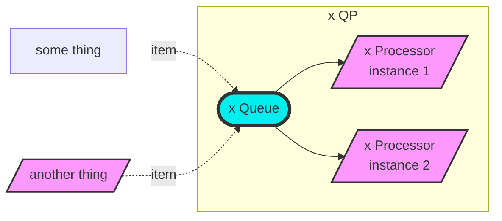
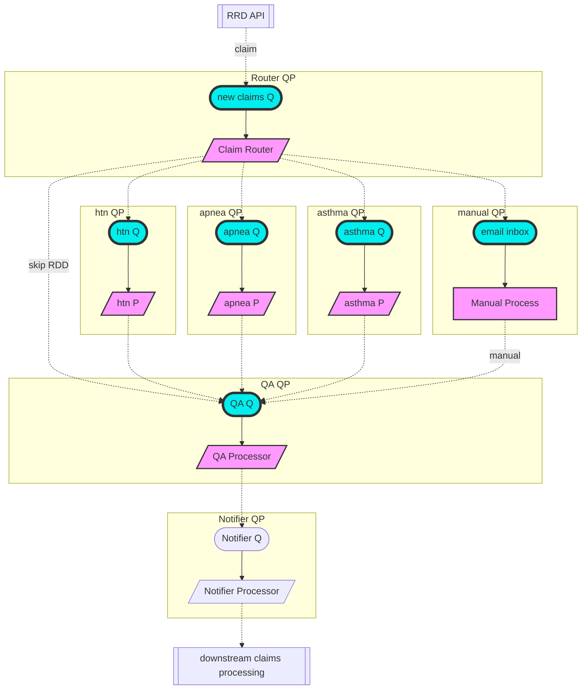

## Goals

This project is skeleton code demonstrating how a Spring-based app uses Apache Camel to implement a microservice architecture.

- Allow folks to familiarize themselves with Java, Gradle, Spring, and Camel tools
- Enables folks to experiment with the code

## Files and directories

- `init.log` - describes how this project was created, along with links to reading materials
- `sourceme.sh` - convenience shell functions
- `app` directory - created by Gradle for the application code. For simplicity, classes for the model, view, controller, services, and Camel routes are saved in this project rather than subprojects.
- `app/build.gradle` - primary build file
- `list` and `utilities` directories - created by Gradle to demonstrate subprojects
- `buildSrc` - created by Gradle to demonstrate sharable build configurations

### Software Design
- QP (Queue-Processor(s)) component acts like an internal microservice that modularizes functionalities so that it can be updated and maintained more easily
    - Consists of one *Queue*, which has a globally unique *name* and simply holds items. Items can be added to the queue by anything. Queue’s contents should be persisted to restore RRD state in case of system failure.
    - A *Processor* processes items from the Queue. They are stateless and preferably idempotent. A Processor can be implemented in practically any language (Java, Ruby, Python, etc.), as long as it can interface with a [Message Queue](https://en.wikipedia.org/wiki/Message_queue) (in this case, [RabbitMQ](https://en.wikipedia.org/wiki/RabbitMQ) but [Amazon SQS](https://en.wikipedia.org/wiki/Amazon_Simple_Queue_Service) could be used). For scalability, a Processor can be replicated to process items from the Queue in parallel — shown as “instance 1” and “instance 2” in the diagram.



- QP components will be connected together using well-tested and stable [Enterprise Integration Patterns](https://en.wikipedia.org/wiki/Enterprise_Integration_Patterns) (EIP) tools (such as [Apache Camel](https://camel.apache.org/manual/faq/what-is-camel.html)) so that we can focus on RRD functionality and less on “glue code”.
    - As the RDD prototype becomes more complex, using the same QP pattern for all RRD functionalities promotes low [software coupling](https://en.wikipedia.org/wiki/Coupling_(computer_programming)) and, as a result, simplifies debugging and maintenance.
    - Using EIPs facilitate future migration of parts of the architecture to cloud-based services if needed (see [Implementing EIP with AWS](https://aws.amazon.com/blogs/compute/implementing-enterprise-integration-patterns-with-aws-messaging-services-point-to-point-channels/) and [with Azure](https://docs.microsoft.com/en-us/azure/architecture/reference-architectures/enterprise-integration/queues-events)), where for example a Processor could be implemented as AWS Lambda.
    - Using the Apache Camel implementation of EIPs provides [time-saving features](https://stackoverflow.com/a/11540451) and integrations with many existing [tools](https://camel.apache.org/components/3.15.x/index.html) and [data formats](https://camel.apache.org/components/3.15.x/dataformats/index.html).
    - Example workflow using QP components:


- The Router QP responds to RRD API requests and determines how the claim should be processed
    - For each new claim, it quickly validates the claim to send a response back to the API caller.
    - Based on the claim characteristics and any other data it gathers, it determines how the claim should proceed and adds the claim to an appropriate Queue for processing.
- Each hypertension/asthma/apnea QP components is expected to:
    1. receive an item from its Queue (either pushed or pulled)
    2. gathers health data by querying external data sources
    3. decides on the claim (see details in the “RRD processing” section)
    4. adds a new item to the QA Queue
- A Manual QP component can be included for discovery and research of new types of claims to fast track, or for scenarios where a claim has curious characteristics that require manual intervention.
- The QA Processor performs quality assurance; to validate the RRD processing output and prep it for downstream processing (external to RRD). (Not shown in the diagram: another Manual QP component can be added for cases where the QA Processor finds an unsupported problem with the results.)
- If requested as part of the original RRD API request, the Notifier Processor will execute any requested callbacks to indicate completion of RRD processing on the claim.

## Build and Test

For each new console, run `source sourceme.sh` to define convenience functions.

1. In one console, start RabbitMQ: `startRabbitMQ`
2. In another console, start the application: `./gradlew bootRun`
3. In another console, submit requests to the API:
```sh
curlClaims
# (Expect an empty array for the response)
curlPostContention A

curlClaims
# (Note the `status` is `CREATED`)
(wait 5 seconds)
curlClaims
# (Note the `status` is `DONE_RRD`)

curlWaitForStatusChange
# (This blocks until a change occurs, which will be done in the next step)
```
4. In another console, submit requests to the API:
```sh
curlPostContention A
# (Expect console in prior step to return)
```
